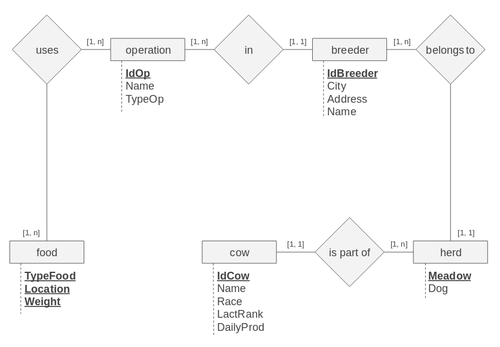

# Managing dairy operations with PostgreSQL

Authors : 
- [Mederic FOURMY](https://github.com/MedericFourmy)
- [Nikola LOHINSKI](https://github.com/NikolaLohinski)

This is a work assignment on the usage of PostgreSQL. The goal is to create
a database to manage several dairy operations with breeders, herds, cows and food, and
progressively add constraints to make it more complex. The relations between each entity is given
by the following figure :

The questions of the assigment were to :
- Q3) Create all tables from the model, with specific constraints and checkers
- Q4) Populate the tables with toy data (any reference to actual people or 
events is entirely fictional)
- Q5a) Determine the total daily production of milk
- Q5b) Determine the production for each separate dairy operation, and order them by
decreasing value
- Q5c) Select and rank the cows of each single operation by daily production
- Q5d) Create a function to get daily average production of a specific race for
a specific breeder
- Q5e) Create a function to get the number of cows and the number of cows with 
lactation rank of 5 for each operation
- Q6) Take into account the mammite, a common disease among cows, that makes a
 cow unable to produce milk
- Q7) Take into account the law on GAEC operations, which need to have between 
2 and 10 breeders to have that legal state.
- Q8) Take into account the law on AOC herds, which need to be of one race only.
